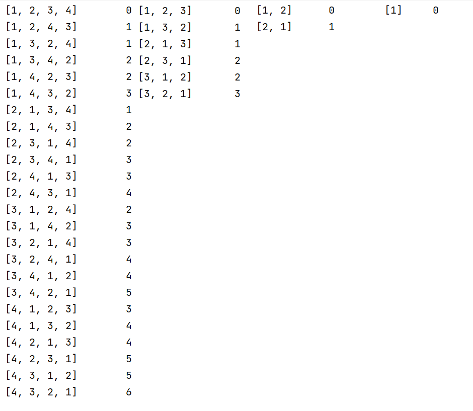
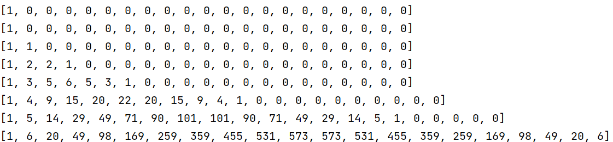

0629.k个逆序对数组

[0629.k个逆序对数组](https://leetcode-cn.com/problems/k-inverse-pairs-array/)

看了官方和宫水三叶等多个大佬的，还是发现没图真是难懂。。。


#### 解法1：递推（超时）


由图可知，每个排列都可以由最后一个数字插入前一个数组的不同位置组成，而对应的逆序数组也有原先的数组的逆序数组的数量和插入的位置共同决定。

如[1,2,3] 逆序数组为0 ，将4插入最后，逆序数组依然为0，将4插入到最前，逆序数组为3。





因此，可以简单的写出以下代码，依据层数推导所有的可能性，但是时间复杂度数为$O(n^2*k)$，超时了

```java
public int kInversePairs(int n, int k) {
    //卫语句
    if (k == 0) {
        return 1;
    }
    Map<Integer, Long> result = Map.of(0,1L);
    //层数
    for (int i = 2; i <= n; i++) {
        HashMap<Integer, Long> nextLevel = new HashMap<>();
        for (int j = 0; j < i; j++) {
            for (Map.Entry<Integer, Long> entry : result.entrySet()) {
                Integer newKey=entry.getKey()+j;
                //剪枝语句，若无则是推导所有可能性，若有则是值推导k前的，因为k的值只和小于等于k的前层有关
                if (newKey>k){
                    continue;
                }
                Long newValue=entry.getValue()+nextLevel.getOrDefault(newKey,0L);
                if (newValue>1000000007){
                    newValue=newValue%1000000007;
                }
                nextLevel.put(newKey,newValue);
            }
        }
        result=nextLevel;
    }
    //        System.out.println(result);
    return (int) (result.getOrDefault(k,0L)+0);
}

```


#### 解法2： 动态规划+前缀和+滑动数组优化空间

由前面可以写出以下矩阵，可以发现arr\[i]\[j] 为前一行最大长为i的项的和。





```java
public int kInversePairs(int n, int k) {
    //卫语句
    if (k == 0) {
        return 1;
    }
    //前缀和
    int[][] judgeArray = new int[n + 1][k + 1];
    judgeArray[0][0] = 1;
    for (int i = 1; i <= n; i++) {
        long preSum = 0;
        for (int j = 0; j <= k; j++) {
            preSum += judgeArray[i - 1][j];
            if (j >= i) {
                preSum -= judgeArray[i - 1][j - i];
            }
            preSum = (preSum + 1000000007) % 1000000007;
            judgeArray[i][j] = (int) preSum;
        }
    }
    Tools.showArray(judgeArray);
    return judgeArray[n][k];
}
```


然后加上滑动窗口优化空间


```java
public int kInversePairs(int n, int k) {
    //卫语句
    if (k == 0) {
        return 1;
    }
    //前缀和，滑动窗口优化
    int[][] judgeArray = new int[2][k + 1];
    judgeArray[0][0] = 1;
    for (int i = 1; i <= n; i++) {
        long preSum = 0;
        for (int j = 0; j <= k; j++) {
            //只累加当前行长度的数量
            preSum += j >= i ? judgeArray[(i + 1)%2][j] - judgeArray[(i + 1)%2][j - i] : judgeArray[(i + 1)%2][j];
            //防止负数出现导致计算结果出错
            preSum = (preSum + 1000000007) % 1000000007;
            judgeArray[i%2][j] = (int) preSum;
        }
    }
    //        Tools.showArray(judgeArray);
    return judgeArray[n%2][k];
}

```

