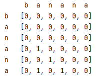

1044.最长重复子串

[1044.最长重复子串](https://leetcode-cn.com/problems/longest-duplicate-substring/)

写的dp内存超了，抄的前缀和+二分搜索方法

#### 解法1：动态规划

建立一个二维矩阵，宽和高都为字符串的长度

在除去对角线的三角形中（下三角或上三角均可）将所有字符相同的交点记为1，然后搜索矩阵的斜线即可。


（可将搜索和建立矩阵统一但未进行优化，反正内存过不了）
```java
public String longestDupSubstring(String s) {
    char[] chars = s.toCharArray();
    int [][]matrix = new int[chars.length][chars.length];
    //矩阵填充
    for (int i=0;i<chars.length;i++){
        for (int j=0;j<i;j++){
            if (chars[i]==chars[j]) {
                matrix[i][j]=1;
            }
        }
    }
    Tools.showMatrixWithAxis(matrix,chars,chars,false);
    int maxLenth=0,start=0;
    //对斜线进行搜索
    for (int lastStart=1;lastStart< matrix.length;lastStart++){
        for (int offset=0,count=0;offset+lastStart<matrix.length;offset++){
            if (matrix[lastStart+offset][offset]==1){
                count++;
                if (count>maxLenth){
                    maxLenth=count;
                    System.out.println(lastStart +"\t"+(offset-maxLenth+1));
                    start=offset-maxLenth+1;
                }
            }else {
                count=0;
            }
        }
    }
    return s.substring(start,start+maxLenth);
}
```

#### 解法2：前缀和+二分搜索

解法抄自

[1044.最长重复子串](https://leetcode-cn.com/problems/longest-duplicate-substring/solution/gong-shui-san-xie-zi-fu-chuan-ha-xi-ying-hae9/)

核心思想是使用前缀和简化计算，降低时间复杂度

利用大质数取余减少哈希冲突的几率

使用二分搜索快速找到需要的长度。

```java
static int P=1313131;
//顶部作用域
long []pri,hash;
public String longestDupSubstring(String s) {
    char[] chars = s.toCharArray();
    //预先计算
    //P的n次方
    pri=new long[s.length()+1];
    //哈希
    hash=new long[s.length()+1];
    pri[0]=1;
    for (int i=0;i<chars.length;i++){
        pri[i+1]=pri[i]*P;
        hash[i+1]=hash[i]*P+chars[i]+chars[i];
    }
    String result="";
    int l=0,r=chars.length;
    while (l<r){
        int mid = l +r +1>>1;
        String t = hasResult(s,mid);
        if (t.length() !=0){
            l=mid;
        }else {
            r=mid-1;
        }
        result=t.length()>result.length()?t:result;
    }
    return result;
}

String hasResult(String s,int len){
    int n =s.length();
    Set<Long> set = new HashSet<>();
    for(int i=1;i+len-1<=n;i++){
        //尾部
        int j = i + len -1;
        long cur = hash[j]-hash[i-1]*pri[ len];
        if (set.contains(cur)){
            return s.substring(i-1,j);
        }
        set.add(cur);
    }
    return "";
}
```