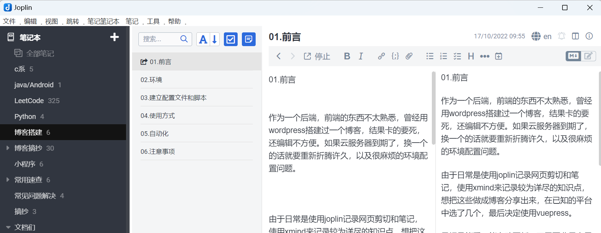
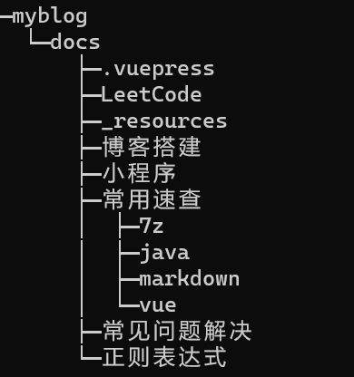

01.前言

作为一个后端，前端的东西不太熟悉，曾经用wordpress搭建过一个博客，结果卡的要死，还编辑不方便。如果云服务器到期了，换一个的话就要重新折腾许久，以及很麻烦的环境配置问题。

由于日常是使用joplin记录网页剪切和笔记，使用xmind来记录较为详尽的知识点，想把这些做成博客分享出来，在已知的平台中选了几个，最后决定使用vuepress。

目标是能看，能自动更新，不需要费尽心思重新编辑自己的博客之类的，平台迁移要尽可能简便迅速。

由于joplin可以直接导出带图片资源的markdown，xmind也支持markdown导出。因而选择markdown作为中转格式。

最后采用的方法是docker+vuepress部署页面，git配合github来进行同步，采用python脚本来进行导航栏的配置和每个文件夹下的博客目录自动生成（js属实不熟，而仿照官方文档中的路由配置，要给每个博客写头，与期望的简单导出即可不符）。

linux的定时任务配合shell脚本来实现自动同步(自动更新)。

最后的结果即为:

1. joplin中写好要分享的博客部分，导出为markdown。

2. github同步

3. 每日凌晨,服务器中的定时任务执行脚本拉取最新源码

4. python 脚本生成导航栏和每个栏目的README目录文件

5. 重启docker容器，更新博客的内容
   

在本地维护的文件夹层级即为博客的层级目录

##### joplin页面

##### 文件层次结构

##### 博客导航栏

如果你能看到这篇文章，就证明这个方法搭建博客成功了。

参考博客：

https://www.cnblogs.com/softidea/p/10084946.html

vuepress官方文档。
