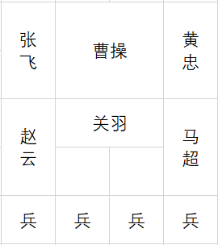
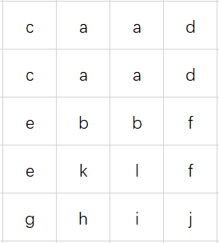
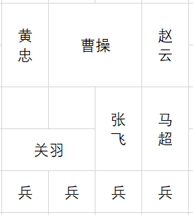
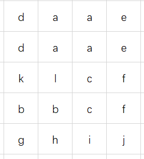
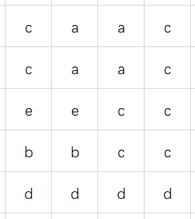
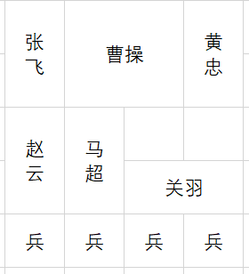
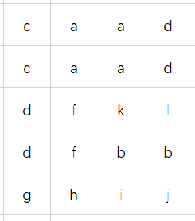

华容道游戏算法实现

# 简介

华容道简介
[百度百科](https://baike.baidu.com/item/%E5%8D%8E%E5%AE%B9%E9%81%93/23619)
源码已经放在github上，需要可自取
开始写算法时，使用的eclipse，后来用AS加的界面，所以两方面衔接不是太好。
在PC端计算横刀立马用时约1.5s，手机端更慢一些
[github链接](https://github.com/formatjn2019/hrd)
这里只讲解思路

# 棋子

共有5种棋子（空格也算一种棋子）
曹操2\*2
关羽2\*1
四上将1\*2
兵1\*1
空格1\*1

总计棋子五种类型使用abcde表示
总计棋子12个，使用a~l表示

# 棋盘

棋盘使用二维数组表示大小为5*4

实际棋局

抽象表示

## 棋盘的压缩存储

每个棋子在棋盘中的位置可以表示为
对于曹操与四上将，高度为2，纵坐标最大为3
因此可以四位二进制表示，如开局曹操坐标为 01,00
对于关羽与兵，纵坐标最大为4，使用五位二进制表示
如第一个兵g，坐标为00,100,
共需1\*4 + 4\*4 + 1\*5 + 4\*5 + 2\*5 = 55 个二进制位（算上了空格）
可以存储于long类型中（用于记录步骤，可用来比较，是否走过）

## 棋局状态的表示

棋局1

棋局1实际表示

如棋局1的状态可以表示为：

同样对棋局类型进行压缩存储，但不再存储空格，每次搜索一种类型，将最终结果存放于long类型中。
如果将黄忠和张飞的位置互换，棋局的存储会不同，但计算出棋局的状态是相同的。
在求解的时候可以使用棋局状态作为判定条件，减小不必要的计算。

棋局2

棋局2实际表示

棋局1和棋局2看似不同，实际上棋局2可以看作棋局1的镜像翻转，即只要走出其中一种局面，就可以求出正确的解法，因此对两种棋局都进行求解是不必要的。

所以，每次计算棋局，都计算棋局的状态和棋局的镜像状态，便于判定。

# 求解

我采用的是树的层优先遍历进行求解。
在对一种棋局进行求解时，把当前棋局作为根节点，开始建树，每个节点只记录自己的父节点，当某一节点为终止节点，即曹操坐标为01,11时，建树停止，所得解为最优解，依次压栈出栈可以获得求解步骤。

进行建树时，每产生一个节点，就记录该节点类型和该节点的镜像节点类型，对树进行剪枝：如果树的新节点类型以及存在，则该节点不再生成子节点。
