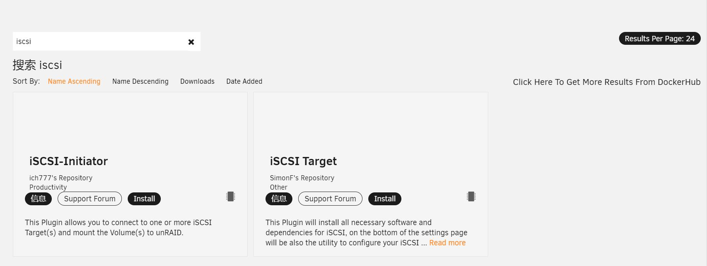
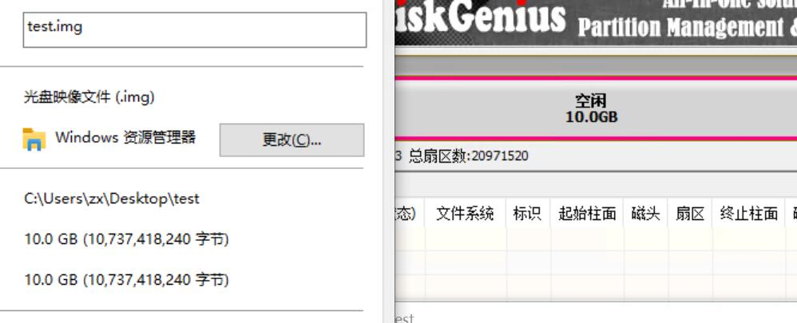
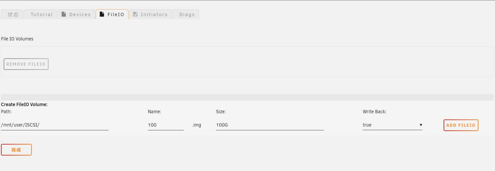
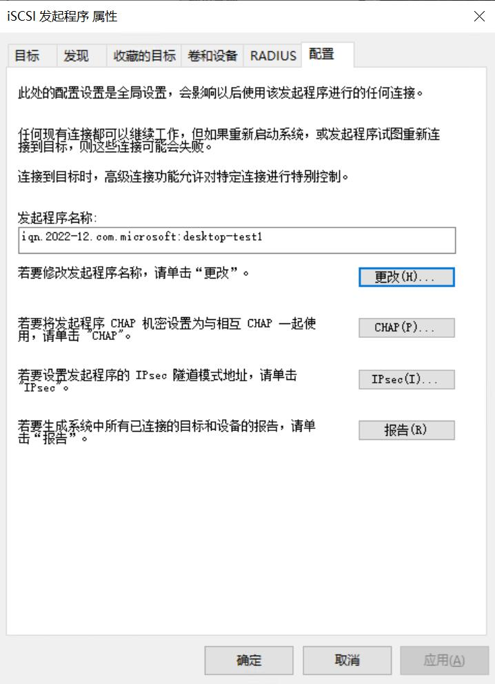
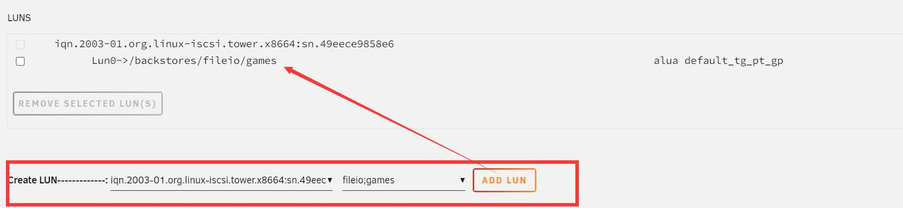
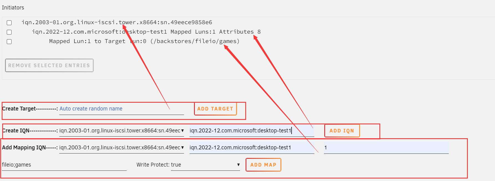
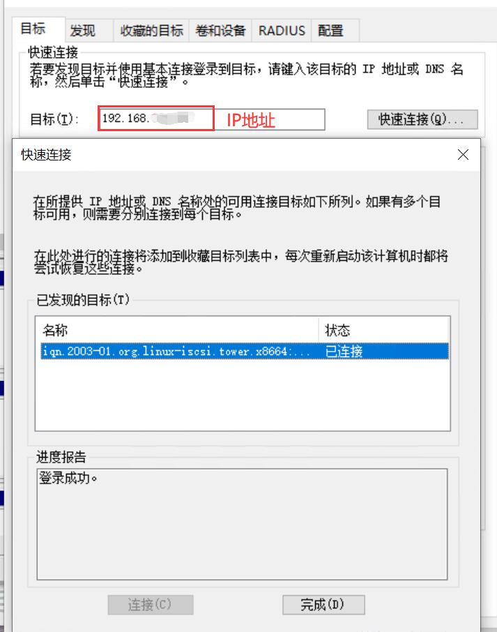
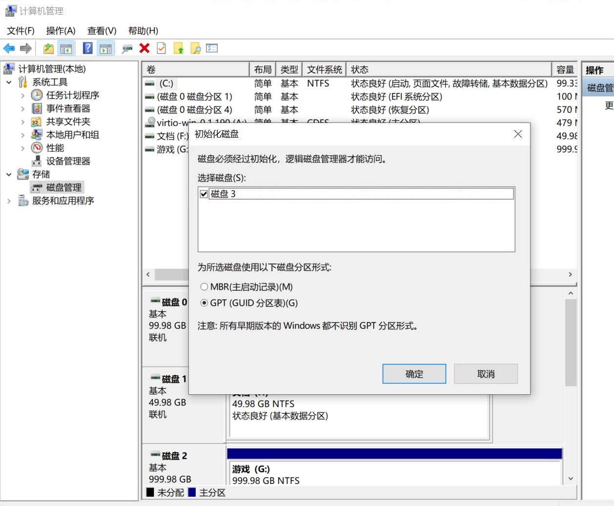
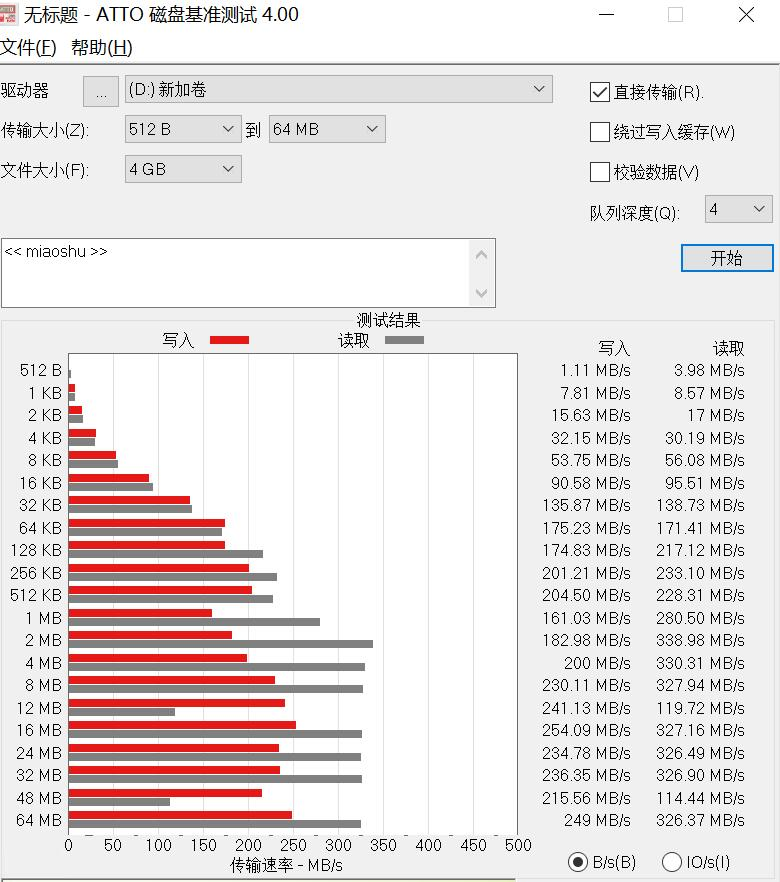

### 前言

由于我目前用的虚拟磁盘居多，只演示使用虚拟磁盘文件(img)的ISCSI发起方法。实际使用物理磁盘也可以的。

### ISCSI简介

[ISCSI 维基百科](https://zh.wikipedia.org/wiki/ISCSI)

### 环境

- 日期
  2022.12.16

- 系统
  unraid 6.10.3
  win10 虚拟机
- 网卡
  unraid 虚拟网卡

### 安装

在应用商店搜索ISCSI

第一个为连接插件，可装可不装，第二个为发起插件，必装

### 配置

#### ISCSI命名规范

命名规范

[iSCSI 命名约定 (vmware.com)](https://docs.vmware.com/cn/VMware-vSphere/7.0/com.vmware.vsphere.storage.doc/GUID-686D92B6-A2B2-4944-8718-F1B74F6A2C53.html)

#### 准备
##### 创建img文件

这里创建可以使用多种方式，比如使用diskgenius创建，使用dd命令创建，甚至在创建虚拟机时额外创建一块虚拟硬盘。

（注，dg创建的大小与虚拟磁盘的大小等大）

这里采用iscsi Target 插件创建（在unraid->插件->ISCSI->FileIO），位置，大小设置好后，回写一定要打开。(使用其它方式创建的也需要在这里进行映射，这里省了一步。)

这里不清楚是btrfs文件系统，还是其它原因，总之不占空间。

##### 记录IQN

在Windows搜索ISCSI,打开ISCSI发起程序，在配置栏可修改IQN(发起程序名称)，也可使用默认，注意命名规范。IQN复制备用。

#### 插件设置

在unraid->插件->ISCSI->Initiators

1. 首先建立Target，自定义注意命名规范，不填会生成随机IQN，即第二个红框。

2. 然后建立LUN, 使用下拉框将第一步生成的IQN和刚才建立的虚拟磁盘进行映射，即第一个红框。

3. 接着建立IQN, 左侧为下拉框，右侧为ISCSI发起程序中复制的IQN，第三个红框。

4. 最后在map中建立映射，其中第三个空的数字可随便填，建议从0或者1开始递增，不要重复,第四个红框

#### Windows配置

ISCSI发起程序->目标->快速连接，输入unraid的ip地址

打开计算机管理->磁盘管理，即可如普通硬盘一样进行初始化操作。

#### 不严谨的速度测试

图中速度已经超出了磁盘本身的速度，大概看看就好。

参考博客：
[[NAS踩坑日记] UNRAID配置iSCSI实验](https://www.bilibili.com/read/cv12228943)
